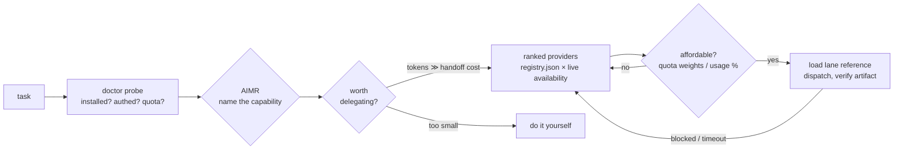

# AIMR — AI Model Router

**Aim agent work at the best model you can afford.**

AIMR is a single skill that teaches your AI agent to drive every other AI
CLI: which model wins each kind of work, what it costs against your real
accounts, and the operational gotchas that make the difference between a
clean artifact and a burned afternoon. Rankings come from benchmarks, not
vibes — and where there's no benchmark yet, the registry says so instead of
making a number up.



## What you get

- **One skill, seven capabilities** — image generation, image-to-video,
  code recon, web research, delegated implementation, second-opinion review,
  long-context/multimodal reading. Each capability
  ranks its providers best-first with four contracts: how to invoke, what
  comes back, what it costs, and the benchmarked score that earned the rank.
- **The doctor** — `scripts/aimr_doctor.py` probes, in under 2 seconds with
  zero network calls, which provider CLIs are installed, which are
  authenticated (and on what plan), and which lanes are routable right now —
  including Codex primary/weekly quota windows read free from its own local
  session files. `--deep` adds live network probes: Claude 5h/7d/per-model
  utilization via the OAuth usage endpoint, a live Codex rate-limit read
  when no local snapshot exists, and gemini/grok liveness. Every failing
  pool comes with the exact fix command. The agent routes on ground truth
  instead of guessing — and when the top lane is dead it substitutes
  *visibly*, never silently.
- **A model cost catalog** — submodels (fable/opus/sonnet/haiku, gpt-5.5,
  …), their effort levels, API $/MTok, and quota-draw weights for
  subscription pools where per-token dollars are a fiction. Routing picks the
  lowest-weight lane that clears the quality bar.
- **Delegation economics** — delegation has a fixed per-handoff cost (every
  boundary token is billed twice). AIMR routes *and* tells your agent when
  not to delegate at all, when to use a cheap executor with an expensive
  advisor at checkpoints, and when a different-model verifier beats a
  same-model review.
- **The operational knowledge** — gotchas earned from real runs: the 150-word
  prompt timeout, the named-artist moderation trap disguised as a rate limit,
  the worktree that can't see your local commits, the "timed-out" generation
  that actually finished, the negative claim about a 24.9k-star repo that
  "didn't exist".

## Install (60 seconds)

**Claude Code (plugin):**

```
/plugin marketplace add amirhjalali/aimr
/plugin install aimr
```

**Any agent that reads markdown skills:** copy `skills/aimr/` into your
skills directory (e.g. `~/.claude/skills/`), or just point the agent at this
repo — everything load-bearing is markdown + JSON, starting at
`skills/aimr/SKILL.md`.

No Python required to route. The two bundled scripts (image runner, worktree
harness) are stdlib-only and used by their lanes when dispatched.

## Current lanes

| Capability | Best routable | Score (source) | Notes |
|---|---|---|---|
| image-generation | Codex / GPT Image 2 | 4.97 (seeded, 20-archetype eval) | text-in-scene, POD, style fusion; ~119s/img |
| image-to-video | Grok `image_to_video` | 3.5 previz (seeded) | previz only (448–672px); no production lane routed |
| code-recon | Codex `exec` @ xhigh | 4.5 (seeded) | verify constants; distrust negative claims |
| web-research | Codex `exec` + web search | unscored, seeded findings | ~1 error / 40 citations; probe negatives |
| code-implementation | Codex + worktree harness | 4.3 (seeded) | review is never delegated |
| review-second-opinion | Claude Opus subagent | unbenchmarked | different-model review beats same-model |
| long-context-multimodal | Gemini CLI | unbenchmarked (draft) | first candidate for a pack-run suite |

`seeded` = imported from prior benchmark studies (each entry names its
source); replacing seeds with pack-run suite scores is the standing priority.

## How it stays honest

- **No score without a suite and a date.** Unbenchmarked lanes say so
  (`overall: null`) — the registry never invents numbers.
- **Newest ≠ best** is an empirical rule here: the Codex CLI's newer default
  model lost a side-by-side audition to gpt-5.5 (the retired image-lane evals
  showed the same pattern).
- **Scope is agent-drivable CLIs.** Quality winners an agent can't script
  (web-UI-only tools) don't get routed — the `human_options` mechanism
  records them for humans when one earns its place, instead of pretending a
  lane exists.
- **Every cost number carries a source and a confidence** (`exact` vs
  `estimated`). Vision-LLM judging only in benchmarks — pixel metrics
  measured r≈0.08 against human preference and are banned.
- **Probe output follows the same rule**: every usage reading carries its
  source, its age, and a confidence — and probe *results* never get written
  into the registry (rankings are the slow-moving quality layer; the doctor
  is the live availability layer). Probes can lie, so readings are soft
  signals, never hard gates.

## Roadmap

- ~~v2.1 — usage awareness~~ **shipped** as the doctor (2026-07-13): probe
  first, report honestly, never a ledger — budget machinery stays banned
  from core. A cross-provider statusline wrapping `aimr_doctor.py --json`
  remains an optional future extra.
- **v2.2 — first pack-run benchmark suite** (`web-research-v1` or
  `longcontext-v1`), retiring the first seeded scores and bringing back the
  suite runner machinery.
- **More lanes** — the doctor already detects installed-but-unrouted agent
  CLIs (droid, opencode, agy, …) as candidates; see
  [CONTRIBUTING.md](CONTRIBUTING.md) for the add-a-lane recipe and the
  honesty bar a new lane has to clear.

## Layout

```
skills/aimr/            the product: SKILL.md + registry.json + references/ + scripts/
  SKILL.md              the routing procedure (step 0: run the doctor)
  registry.json         models catalog + pools probe metadata + capability → ranked providers
  references/           per-lane invocation discipline and gotchas
  scripts/              doctor (availability/usage probe) + image runner + worktree harness
benchmarks/             methodology, rubric, judge prompt (suite runner returns in v2.2)
tests/                  schema checks + doctor behavior tests, run in CI
```

## Lineage

AIMR grew out of [agent-wrangler](https://github.com/amirhjalali/agent-wrangler),
a tmux-based control layer for running teams of coding agents from one
terminal. The wrangler runs the herd; AIMR packs the knowledge of *which mount
to saddle for which terrain, and what each one costs to feed* into a form any
agent can carry.

## License

MIT
