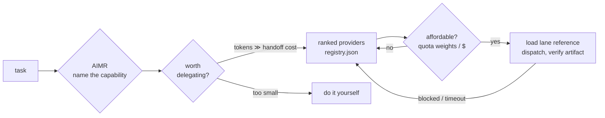

# AIMR — AI Model Router

**Aim agent work at the best model you can afford.**

AIMR is a single skill that teaches your AI agent to drive every other AI
CLI: which model wins each kind of work, what it costs against your real
accounts, and the operational gotchas that make the difference between a
clean artifact and a burned afternoon. Rankings come from benchmarks, not
vibes — and where there's no benchmark yet, the registry says so instead of
making a number up.



## What you get

- **One skill, eight capabilities** — image generation, reference edits,
  image-to-video, code recon, web research, delegated implementation,
  second-opinion review, long-context/multimodal reading. Each capability
  ranks its providers best-first with four contracts: how to invoke, what
  comes back, what it costs, and the benchmarked score that earned the rank.
- **A model cost catalog** — submodels (fable/opus/sonnet/haiku, gpt-5.5,
  …), their effort levels, API $/MTok, and quota-draw weights for
  subscription pools where per-token dollars are a fiction. Routing picks the
  lowest-weight lane that clears the quality bar.
- **Delegation economics** — delegation has a fixed per-handoff cost (every
  boundary token is billed twice). AIMR routes *and* tells your agent when
  not to delegate at all, when to use a cheap executor with an expensive
  advisor at checkpoints, and when a different-model verifier beats a
  same-model review.
- **The operational knowledge** — gotchas earned from real runs: the 150-word
  prompt timeout, the named-artist moderation trap disguised as a rate limit,
  the worktree that can't see your local commits, the "timed-out" generation
  that actually finished, the negative claim about a 24.9k-star repo that
  "didn't exist".

## Install (60 seconds)

**Claude Code (plugin):**

```
/plugin marketplace add amirhjalali/aimr
/plugin install aimr
```

**Any agent that reads markdown skills:** copy `skills/aimr/` into your
skills directory (e.g. `~/.claude/skills/`), or just point the agent at this
repo — everything load-bearing is markdown + JSON, starting at
`skills/aimr/SKILL.md`.

No Python required to route. The two bundled scripts (image runner, worktree
harness) are stdlib-only and used by their lanes when dispatched.

## Current lanes

| Capability | Best routable | Score (source) | Notes |
|---|---|---|---|
| image-generation | Codex / GPT Image 2 | 4.97 (seeded, 20-archetype eval) | text-in-scene, POD, style fusion; ~119s/img |
| image-edit | Grok `image_edit` | 4.7 (seeded, 2026-07-10) | wins the hard back-angle class |
| image-to-video | Grok `image_to_video` | 3.5 previz (seeded) | hero clips: Kling 4.8, human-driven |
| code-recon | Codex `exec` @ xhigh | 4.5 (seeded) | verify constants; distrust negative claims |
| web-research | Codex `exec` + web search | unscored, seeded findings | ~1 error / 40 citations; probe negatives |
| code-implementation | Codex + worktree harness | 4.3 (seeded) | review is never delegated |
| review-second-opinion | Claude Opus subagent | unbenchmarked | different-model review beats same-model |
| long-context-multimodal | Gemini CLI | unbenchmarked (draft) | first candidate for a pack-run suite |

`seeded` = imported from prior benchmark studies (each entry names its
source); replacing seeds with pack-run suite scores is the standing priority.

## How it stays honest

- **No score without a suite and a date.** Unbenchmarked lanes say so
  (`overall: null`) — the registry never invents numbers.
- **Newest ≠ best** is an empirical rule here: flux-1.1-pro outbenchmarks the
  newer flux-2-pro; the Codex CLI's newer default model lost a side-by-side
  audition to gpt-5.5.
- **Web-UI providers aren't hidden.** Kling and Seedream win their lanes on
  quality but can't be scripted — the registry records them as
  `human_options` and the router surfaces them to you instead of pretending
  they don't exist.
- **Every cost number carries a source and a confidence** (`exact` vs
  `estimated`). Vision-LLM judging only in benchmarks — pixel metrics
  measured r≈0.08 against human preference and are banned.

## Roadmap

- **v2.1 — usage manager (optional extra):** live remaining-quota awareness
  across accounts — probe-first (Claude Code's local session data is genuinely
  parseable; other CLIs fall back to estimates), with a statusline one-liner
  for your prompt. Optional install; core AIMR routes fine without it.
- **v2.2 — first pack-run benchmark suite** (`web-research-v1` or
  `longcontext-v1`), retiring the first seeded scores and bringing back the
  suite runner machinery.
- **More lanes** — see [CONTRIBUTING.md](CONTRIBUTING.md) for the add-a-lane
  recipe and the honesty bar a new lane has to clear.

## Layout

```
skills/aimr/            the product: SKILL.md + registry.json + references/ + scripts/
  SKILL.md              the routing procedure
  registry.json         models catalog + capability → ranked providers
  references/           per-lane invocation discipline and gotchas
  scripts/              image runner + worktree harness (stdlib-only)
benchmarks/             methodology, rubric, judge prompt (suite runner returns in v2.2)
tests/                  schema checks that enforce the honesty rules in CI
```

## Lineage

AIMR grew out of [agent-wrangler](https://github.com/amirhjalali/agent-wrangler),
a tmux-based control layer for running teams of coding agents from one
terminal. The wrangler runs the herd; AIMR packs the knowledge of *which mount
to saddle for which terrain, and what each one costs to feed* into a form any
agent can carry.

## License

MIT
